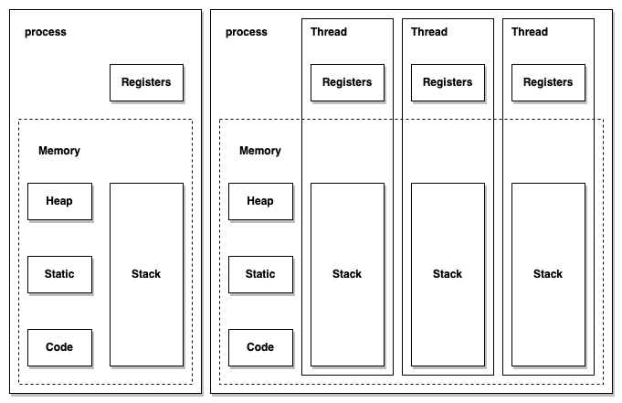
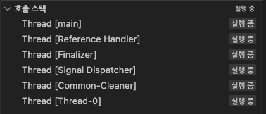

# Thread Programming(스레드 프로그래밍)


## 프로세스와 스레드

* 하나의 프로세스는 여러 개의 스레드로 구성이 가능
* 하나의 프로세스를 구성하는 스레드는 프로세스에 할당된 메모리와 자원을 구성
* 스레드별로 Stack과 Register를 가지고 있음
* 한 번에 하나의 스레드만 실행 가능


**그림. 프로세스와 스레드**

<p>
	
</p>

## Process(프로세스)

* 실행 중인 프로그램을 의미한다.
* 스케줄링의 대상이 되는 작업(task)과 같은 의미로 쓰인다.
* 하드 디스크의 프로그램을 실행하면, 실행을 위해서 메모리 할당이 이루어지고 할당된 메모리 공간으로 바이너리 코드가 올라간다.
  * 이 순간부터 프로세스라고 불림


## Thread(스레드)

* Thread of Control을 줄인 말로, 제어의 흐름을 시각적 표현


**그림. Thread**


<p>
	
</p>


##


## Java에서의 스레드 구현

* Thread 클래스 상속
* Runnable 인터페이스


### Thread 클래스 상속에 의한 구현

Thread 클래스 상속에 의한 구현은 Java에서 지원해 주는 Thread 클래스를 상속하여 구현하는 것을 말한다.


**그림. Thread 클래스 상속도**

~~~mermaid
classDiagram
	FunctionalInterface <|-- Runnable
	Runnable <|-- Thread
~~~


Thread의 상태 상태에 대해서는 뒤에서 알아보기로 하고 먼저 Thread를 간단히 동작시켜 보도록 한다.


Thread 클래스를 이용해 Thread를 생성하기 위해서는 먼저 Thread 클래스를 확장하여 새로운 클래스를 정의하며,  아래의 코드는 수행하는 동안 주어진 메시지를 무한 출력하도록 Thread 클래스에서 상속하여 구성하였다.

~~~java
public class ExtendedThread extends Thread {
    private String message;
    private int loopCount;
    public ExtendedThread(String message) {
        this.message = message;
        loopCount = 0;
    }

    @Override
    public void run(){
        while(!Thread.interrupted()) {
            try {
                ++loopCount;
                System.out.println(message + " : " + loopCount);
                Thread.sleep(1000);
            } catch (InterruptedException e) {
                interrupt();
            }
        }
    }
}

~~~


테스트 코드를 작성하고

~~~java
package test;

import org.nhnacademy.thread.ExtendedThread;

class TestExtendedThread {
    public static void main(String[] args){
        ExtendedThread thread = new ExtendedThread("thread");

        thread.start();
    }
}
~~~


 실행한 결과는 다음과 같다.

~~~shell
thread : 1
thread : 2
thread : 3
...
~~~


위의 코드는 아래의 코드와 결과가 달라 보이지 않는다.

~~~java
package test;

class TestExtendedJava {
    public static void main(String[] args) throws InterruptedException {
        int loopCount = 0;

        while(!Thread.interrupted()) {
                ++loopCount;
                System.out.println("main : " + loopCount);
                Thread.sleep(1000);
        }
    }
}
~~~

 실행한 결과는 다음과 같다.

~~~shell
main : 1
main : 2
main : 3
main : 4
~~~


이유는 무엇일까?

VSCode의 디버깅 환경에서 두 코드 실행을 비교해 보자.

먼저 TestExtendedJava를 디버그 모드로 실행하고, 좌측에 보이는 호출 스택을 확인하자.


그리고, TestExtendedThread를 디버그 모드로 실행하고, 위와 동일하게 호출 스택을 확인하자.


두 가지 실행을 비교해 볼 때 호출 스택에 보이는 정보가 다르다.


그럼, 다음 코드를 비교해 보자.

~~~java
package test;

import org.nhnacademy.thread.ExtendedThread;

class TestExtendedThread2 {
    public static void main(String[] args) throws InterruptedException {
        int loopCount = 0;
        ExtendedThread thread = new ExtendedThread("thread");

        thread.start();

        while(!Thread.interrupted()) {
                ++loopCount;
                System.out.println("main : " + loopCount);
                Thread.sleep(1000);
        }
    }
}
~~~

실행한 결과는 다음과 같다.

~~~java
main : 1
thread : 1
thread : 2
main : 2
thread : 3
main : 3
main : 4
thread : 4
~~~

실행 후 호출 스택을 보면 아래와 같다.




#### 문제 1. Thread 클래스를 이용해 독립적으로 수행되는 객체를 만들자. Thread 클래스를 확장해 정의하라

* Thread 클래스를 확장해 독집적으로 수행할 수 있는 객체 생성을 위한 클래스를 정의합니다.

* 정해진 시간 간격으로 메시지를 출력하도록 스레드로 동작하는 클래스를 정의합니다.

* 동작 시간 각기 다른 두 개의 객체를 생성합니다.

* 두 개의 객체를 동작시켜 메시지 출력 시간 간격을 확인합니다.

* 스레드의 동작 상태에 관해 확인합니다.

~~~java
public class Exmaple1_1 {
    static class Task extends Thread {
  		...
    }

    public static void main(String [] args) throws InterruptedException {
        Task task1 = new Task(2000);
        Task task2 = new Task(3000);

        task1.start();
        task2.start();

        for(int i = 0 ; i < 100 ; i++) {
            System.out.printf("%s - %s\n", task1.getState(), task2.getState());
            Thread.sleep(1000);
        }
    }
}
~~~

실행 결과는 아래와 같습니다.

~~~shell
RUNNABLE - TIMED_WAITING
TIMED_WAITING - TIMED_WAITING
Thread-0
TIMED_WAITING - TIMED_WAITING
Thread-1
TIMED_WAITING - TIMED_WAITING
Thread-0
TIMED_WAITING - TIMED_WAITING
TIMED_WAITING - TIMED_WAITING
Thread-1
Thread-0
TIMED_WAITING - TIMED_WAITING
~~~


#### 문제 2. 클래스에  필드를 추가하고, 이를 이용해서 스레드를 중지시키도록 함수를 추가합니다

* 메인 스레드에서 안전하게 중지시킬 수 있도록 기능을 추가합니다.

* Thread에서 제공하는 stop은 문제를 발생시킬 가능성이 있어 더 이상 사용을 권장하지 않으므로 사용하지 않습니다.
* 무한 반복을 위해 wait 상태로 만들 수 있습니다. 이 경우, 즉시 중지하지 않고, 상태 변경 후 중지됩니다.
* 어떠한 해결 방법이 있을까요?

~~~java
public class Example1_2 {
    static class Task extends Thread {
			...
    }

    public static void main(String [] args) throws InterruptedException {
        Task task = new Task(1000);

        task.start();

        Thread.sleep(5000);

        task.stop2();
      	task.join();
    }
}
~~~

* 위 코드에서 stop()을 재정의하지 않고, stop2()로 정의하였다. 이유는 무엇일까요?


실행 결과는 아래와 같습니다.

~~~shell
스레드[ Thread-0 ]를 시작합니다
스레드[ Thread-0 ] 동작 중
스레드[ Thread-0 ] 동작 중
스레드[ Thread-0 ] 동작 중
스레드[ Thread-0 ] 동작 중
스레드[ Thread-0 ] 동작 중
스레드[ Thread-0 ]를 종료합니다
~~~


#### 문제 3. 클래스에 별도의 필드 추가 없이  스레드를 중지시키도록 함수를 추가합니다

* Thread 클래스에서 지원하는 interrupt() 함수를 이용합니다.


~~~java
public class Example1_3 {
    static class Task extends Thread {
			...
    }

    public static void main(String [] args) throws InterruptedException {
        Task task = new Task(1000);

        task.start();

        Thread.sleep(5000);
        task.stop2();

        task.join();
    }
}

~~~


실행 결과는 아래와 같습니다.

~~~shell
스레드[ Thread-0 ]를 시작합니다
스레드[ Thread-0 ] 동작 중
스레드[ Thread-0 ] 동작 중
스레드[ Thread-0 ] 동작 중
스레드[ Thread-0 ] 동작 중
스레드[ Thread-0 ]에서 인터럽트가 발생하였습니다!
스레드[ Thread-0 ]를 종료합니다
~~~


### Runnable 인터페이스를 이용한 구현

스레드 생성은 앞서 소개한 클래스 상속 외에 Runnable 인터페이스를 통해서도 가능하다.

Thread 클래스의 상속도를 보면 Thread 클래스도 Runnable 인터페이스를 구현하여 정의되었음을 알 수 있다.

아래의 코드는 Runnable 인터페이스를 이용하여 메시지를 무한 출력하도록 구현한 클래스이다.

~~~java
package org.nhnacademy.thread;

public class RunnableThread implements Runnable {
    String title;
    int loopCount;

    public RunnableThread(String title) {
        this.title = title;
        this.loopCount = 0;
    }
    @Override
    public void run() {
        while(!Thread.interrupted()) {
            try {
                ++loopCount;
                System.out.println(title + " : " + loopCount);
                Thread.sleep(1000);
            } catch (InterruptedException e) {
                Thread.currentThread().interrupt();
            }
        }
    }
}
~~~


구현된 코드는 Runnable  인터페이스를 이용해 구현한다는 것 외에는 특별한 차이점이 거의 차이점을 찾을 수가 없다

테스트 코드를 작성하고

~~~ java
class TestRunnableThread {
    public static void main(String[] args){
        Thread thread1 = new Thread(new RunnableThread("One"));
        Thread thread2 = new Thread(new RunnableThread("Two"));
        Thread thread3 = new Thread(new RunnableThread("Three"));

        thread1.start();
        thread2.start();
        thread3.start();
    }
}
~~~

실행한 결과는 Thread 클래스 실행과 동일하다.

~~~shell
Three : 1
Two : 1
One : 1
Two : 2
One : 2
One : 3
Two : 3
Three : 2
Three : 3
One : 4
Two : 4
One : 5
Three : 4
~~~


#### 문제 4. Runnable 인터페이스를 이용해 클래스를 구현하라
* Java의 스레드를 이용하는 두 가지 방법의 하나인 Runnable 인터페이스를 이용해 스레드 확장 클래스를 구현합니다.

* 생성된 클래스는 일정 시간 간격으로 메시지를 출력합니다.

* 일정 시간은 생성자를 통해 생성 시 받습니다.

* Runnable 인터페이스를 이용하여 구현한 경우, 문제점이 무엇일까요?

* 메시지 출력 후 call stack을 확인하고, 앞서 Thread 클래스를 확장한 것과 비교해 봅니다.


~~~java
import java.util.Arrays;

public class Example2_1 {
    static class Task implements Runnable {
			...
    }

    public static void main(String [] args) throws InterruptedException {
        Task task = new Task(1000);
        Thread taskThread = new Thread(task);

        taskThread.start();

        Thread.sleep(5000);

        task.stop();

        taskThread.join();
    }
}

~~~


실행 결과는 아래와 같습니다.

~~~shell
스레드[ Thread-0 ]를 시작합니다
스레드[ Thread-0 ] 동작 중
java.lang.Exception: Stack trace
	at java.base/java.lang.Thread.dumpStack(Thread.java:1383)
	at Example2_1$Task.run(Example2_1.java:24)
	at java.base/java.lang.Thread.run(Thread.java:829)
스레드[ Thread-0 ] 동작 중
java.lang.Exception: Stack trace
	at java.base/java.lang.Thread.dumpStack(Thread.java:1383)
	at Example2_1$Task.run(Example2_1.java:24)
	at java.base/java.lang.Thread.run(Thread.java:829)
~~~


##### 문제 5. Runnable 인터페이스를 이용해 Thread 클래스 상속과 같이 구현하라.

* Runnable 인터페이스를 구현하여 Thread의 메인을 구성합니다.
* 일반적으로 Runnable  인터페이스를 이용할 경우, 별도의 Thread 객체를 생성하고 이를 통해 실행시킵니다.
* 구현된 클래스에서 생성한 객체에서 직접 실행할 수 있도록 클래스를 구성합니다.
* 이처럼 구성할 경우, Thread 클래스를 확장해 구현한 것과 비슷해 보인다. 어떠한 이점과 단점이 있는지 설명합니다.

```java
public class Example2_2 {
    static class Task implements Runnable {
      ...
    }

    public static void main(String [] args) throws InterruptedException {
        Task task = new Task(1000);

        task.start();

        Thread.sleep(5000);

        task.stop();

      	task.join();
    }
}
```

실행 결과는 아래와 같습니다.

~~~java
스레드[ Thread-0 ]를 시작합니다
스레드[ Thread-0 ] 동작 중
스레드[ Thread-0 ] 동작 중
스레드[ Thread-0 ] 동작 중
스레드[ Thread-0 ] 동작 중
스레드[ Thread-0 ] 동작 중
스레드[ Thread-0 ]를 종료합니다
~~~


### Class Thread vs Interface Runnable

그렇다면 Thread 클래스를 이용하는 것과 Runnable 인터페이스를 이용하는 것에 대한 차이는 무엇인가?


두 가지 방안에서의 가장 큰 차이점은 당연히 클래스의 상속과 인터페이스의 구현이라 할 수 있다.

Thread 클래스의 상속을 통해 구현할 경우

* 자바에서 클래스 다중 상속을 지원하지 않으므로, 다른 클래스의 상속이 불가능하다.
* 객체 생성 후 바로 실행할 수 있다


 Runnable 인터페이스의 구현을 통해 구현할 경우

* 다른 클래스에서 상속을 통해 구현할 수 있다.
* 객체 생성 후 바로 사용할 수 없고, 추가적인 Thread 객체가 요구된다.


#### 문제 6. 스레드 안에서 스레드를 생성해 봅니다.

* Task에서 두 개의 주기를 받아 스레드 내에서 스레드를 추가로 실행합니다.
* 결과를 확인합니다. 동작에 관해 설명하세요.

~~~java
public class Example3_1 {
    static class Task implements Runnable {
			...
    }

    public static void main(String [] args) throws InterruptedException {
        Task task = new Task(2000, 1000);

        task.start();

        Thread.sleep(10000);

        task.stop();

        task.join();
    }
}
~~~


##### 문제 7.  스레드 내부에서 생성된 스레드가 종료되도록 수정합니다.

* 3-1에서 발생한 문제를 해결합니다.
* 결과를 확인합니다. 동작에 관해 설명하세요.

기본 코드는 3-1과 동일합니다.


##### 문제 8.  스레드 내부에서 생성된 스레드를 daemon으로 생성해 봅니다.

* Task에서 두 개의 주기를 받아 스레드 내에서 스레드를 추가로 실행합니다.
* 결과를 확인합니다. 동작에 관해 설명하세요.

기본 코드는 3-1과 동일합니다.


### 단일 스레드

* Main 스레드에서 작업 진행, 작업은 순차적으로 진행됨

* 하나의 프로세스에서 오직 하나의 스레드로만 실행
  * 단일 레지스터와 스택으로 구성
  * Context Switching 작업을 요구하지 않음
  * 동시성 제어에 대한 처리를 신경 쓰지 않아도 됨


### 멀티 스레드

* 프로그램 내에서 두 개 이상의 동작을 동시에 실행
  * 프로세서의 활동을 극대화
  * 두 개가 동작을 동시에 실행
* 하나의 프로세스를 다수의 실행 단위로 구분하여 자원을 공유
  * 자원의 생성과 관리의 중복성 최소화
  * 수행 능력 향상


## 스레드 상태

스레드는 아래와 같은 상태를 가질 수 있다.


**그림 6. 스레드 상태**


- New
  스레드가 실행 준비를 완료한 상태로, start() 함수를 호출하기 전 상태
- Runnable
  start()가 호출되어 실행될 수 있는 상태
- Wait
  다른 스레드가 통지할 때까지 기다리는 상태
- Timed_wait
  정해진 시간 동안 기다리는 상태
- Blocked
  사용하고자 하는 객체의 잠금(lock)이 풀릴 때까지 대기하는 상태
- Terminated
  실행이 종료된 상태


**그림 7. 스레드의 생존 주기(Life cycle)**


**Blocked vs Waiting**

| **WAITING**                                                  | **BLOCKED**                                                  |
| ------------------------------------------------------------ | ------------------------------------------------------------ |
| 스레드는  wait() 또는 join()을 호출할 때 WAINTING 상태가 된다. 스레드는 다른 스레드가 notify() 또는 notifyAll()을 호출할 때까지 WAITING 상태를 유지한다. | 스레드는 다른 스레드에서 알림을 받았지만, 아직 개체 잠금이 설정되지 않은 경우 이 상태가 된다. |
| WAITING 스레드는 다른 스레드의 알림을 기다리고 있다.         | BLOCKED 스레드는 다른 스레드가 잠금을 해제하기를 기다리고 있다. |
| WAITING 스레드가 중단될 수 있다.                             | BLOCKED 스레드는 중단될 수 없다.                             |


### 스레드 상태 전이

스레드는 내부 동작에 의해 상태가 변경되거나 외부적 요청에 의해 상태 변경이 가능하다.

외부에서 스레드 상태 변경을 위한 함수는 다음과 같다.

| 함수                                                       | 설명                                                         |
| ------------------------------------------------------------ | ------------------------------------------------------------ |
| **interrupt()**                                              | 일시 정지 상태인 스레드에서 InterruptedException  예외를 발생시켜 <br/> 예외 처리 코드에서 실행 대기 상태로 가거나 종료 상태로 가도록 함 |
| **notify()**<br/> **notiflyAll()**                           | Block 상태에서 wait() 함수에 의해 Wait 상태에 있는 스레드를 <br/>Runnable 상태로 만듦 |
| **sleep(long millis)**  <br/>**sleep(long millis, int nanos))** | 주어진 시간 동안 스레드를 Timed_wait 상태로 만듦. <br/> 주어진 시간이 지나면 자동으로  Runnable 상태로 바뀜 |
| **join()**  <br/>**join(long millis)**<br/>**join(long millis,, int nanos)** | join() 함수를 호출한 스레드는 wait 상태가 됨. <br/> join 함수를 멤버로 가지는 스레드가 종료되거나, <br/> 파라미터로  주어진 시간이 지나면 Runnable 상태로 전이 |
| **wait()**<br/>**wait(long millis)**  <br/>**wait(long millis, int nanos)** | Block에서  스레드를 Wait 상태로 만듦. <br/> 파라미터로 주어진 시간이  시간이 지나면 <br/>Runnable 상태가 됨. 시간이 주어지지  않은 경우, <br/>notify(), notifyAll() 함수에 의해 Runnable  상태로 전이 |
| **yield()**                                                  | 실행 중에 우선순위가  동일하거나 높은 순위의 스레드를 산출하고 Wait 상태로 전이 |


#### interrupt() 함수

* 스레드가 일시 정지 상태에 있을 때, InterruptException 예외를 발생시키는 역할을 한다.
* Thread에서 stop(), suspend(), resume() 등의 동작 제어와 관련된 함수는 안정성 문제로 인해 사용하지 말 것을 권고하고 있다. 기존 시스템과 호환성을 위해 남겨 둘뿐 신규 개발에서는 interrupt 등을 통해 스레드에서 종료하도록 구성해야 한다.


~~~JAVA
public class TestInterrupt {
    static class Task extends Thread {
        public void run() {
            System.out.println("started");
            try {
                while(true) {
                    System.out.println("running!");
                    Thread.sleep(1000);
                }
            } catch(InterruptedException e) {
                System.out.println("Interrupt occurred!");
            }

            System.out.println("finished");
        }
    }

    public static void main(String[] args) {
        Thread thread = new Task();
        thread.start();

        try {
            Thread.sleep(3000);
        } catch (InterruptedException e) {

        }

        thread.interrupt();
    }
}
~~~


#### wait() 함수

* wait()를 호출한 스레드는 동기화 영역에서 락을 풀고 WAITING 상태가 된다.


#### notify()와 notifyAll()

wait() 함수와 함께 notify( *)* 및 notifyAll() 함수는 스레드 간의 통신을 설정하는 데 사용된다. 스레드는 wait() 함수를 호출하여 WAITING 모드로 들어간다. 이 스레드는 다른 스레드가 동일한 객체에 대해 notify( *)* 또는 notifyAll() 함수를 호출할 때까지 WAITING 상태에 있는다.  wait() , notify() 및 notifyAll()을 호출하는 모든 스레드마다 해당 개체의 잠금이 있어야 한다. 즉, 이러한 함수는 동기화된 함수 또는 동기화된 블록 내에서 호출되어야 한다.


**notify()는**

* 스레드가 특정 객체에 대해 notify() 함수를 호출하면 해당 객체의 잠금 또는 모니터를 기다리는 스레드 하나에 대해서만 알린다.

* 이때 선택되는 스레드는 무작위이다. 즉, 통지를 위해 무작위로 하나의 스레드가 선택된다.

* 통지된 스레드는 즉시 개체의 잠금을 가져오지 않고, 호출 스레드가 해당 개체의 잠금을 해제하면 가져온다. 그전까지는 BLOCKED 상태가 된다. 즉, 알림 전 스레드는 WAITING 상태가 된다. 알림을 받으면 BLOCKED 상태로 이동하여 잠금을 얻을 때까지 BLOCKED 상태를 유지한다. 잠금을 얻으면 BLOCKED 상태에서 RUNNING 상태로 이동합니다.


**notifyAll()은**

* 스레드가 특정 개체에 대해 notifyAll() 함수를 호출하면 해당 개체의 잠금을 기다리고 있는 모든 스레드에 알림이 표시된다.
* 통지된 모든 스레드는 WAITING 상태에서 BLOCKED 상태로 이동하고, 우선순위에 따라 개체의 잠금을 얻을 수 있다.
* 객체의 잠금을 얻은 스레드는 RUNNING 상태로 이동하고, 나머지 스레드는 개체 잠금을 얻을 때까지 BLOCKED 상태로 유지된다.


##### sleep(long millis) 함수와 sleep(long millis, int nanos) 함수

* 지정된 시간 동안 스레드를 일시 정지한다.
* 지정된 시간이 지나고 나면 다시 실행상태가 된다.

~~~java
import java.time.LocalDateTime;
import java.time.chrono.ChronoLocalDate;

public class TestThreadSleep {
    static class Task extends Thread {
        @Override
        public void run() {
            System.out.println("[ " + LocalDateTime.now() + " ] " +
                               Thread.currentThread().getName() + ": 시작");
            while(true) {
                try {
                    System.out.println("[ " + LocalDateTime.now() + " ] " +
                               Thread.currentThread().getName() + ": 잠에 듭니다.");
                    Thread.sleep(1000);
                    System.out.println("[ " + LocalDateTime.now() + " ] " +
                               Thread.currentThread().getName() + ": 잠에서 깨어납니다.");
                } catch (InterruptedException e) {
                    break;
                }
            }
            System.out.println("[ " + LocalDateTime.now() + " ] " +
                               Thread.currentThread().getName() + ": 종료");
        }
    }

    public static void main(String [] args) throws InterruptedException {
        Task task1 = new Task();

        task1.start();

        task1.join();
    }
}
~~~


**wait() vs sleep()**

* wait() 및 sleep() 함수는 모두 일정 기간 동안 현재 스레드의 실행을 일시 중지하는 데 사용된다\. 스레드가 wait() 함수를 호출할 때마다 보유하고 있는 잠금을 해제한 후 **WAITING 상태가 된다.** 스레드가 sleep() 함수를 호출할 때마다 보유하고 있는 잠금을 해제하지 않고 **TIMED_WAITING 상태가 된다.**

* **WAITING** 상태(wait() 함수 호출 후 상태)에 있는 스레드는 동일한 잠금에서 notify( **)** 또는 **notifyAll()** 함수를 호출하여 다른 스레드에 의해 깨울 수 있습니다. 그러나, **TIMED_WAITING** 상태(sleep() 함수 호출 후 상태)에 있는 스레드는 깨울 수 없다. 스레드가 잠자는 스레드를 interrupt 하면 InterruptedException이 발생한다.
* wait() 함수는 notify() 및 notifyAll()과 함께 **스레드 간 통신**에 사용되며 sleep() 함수는 특정 시간 동안 **현재 스레드의 실행을 일시 중지하는 데 사용된다.**
* wait() 함수는 **java.lang.Object** 클래스의 인스턴스 함수이다. 즉, 이 함수는 Java로 생성하는 모든 객체에서 사용할 수 있습니다. 여기서 sleep() 함수는 **java.lang.Thread** 클래스의 정적 함수이다. 즉, 스레드에서만 사용할 수 있습니다.

##### join() 함수

다른 스레드가 실행을 완료할 때까지 호출한 스레드가 대기한다.

join 함수는 3가지로 overloading 되어 있다.

* join() : 호출한 스레드가 종료될 때까지 기다린다.

* join(long millis) : 호출한 스레드를 지정된 시간 동안만 기다린다. 대기 시간은 밀리초 단위로 제어한다.

* join(long mills, int nanos) : 호출한 스레드를 지정된 시간 동안 기다린다. 대기 시간은 나노초 단위로 제어한다.


아래 코드는 스레드가 일정 시간 간격으로 지정된 횟수만큼의 메시지를 출력하고 종료하는 프로그램입니다. main에서는 스레드 실행 후 join() 함수를 이용해 종료하기를 기다리고, 스레드 종료가 확인되면  전체 프로그램을 종료한다.

~~~java
import java.time.LocalDateTime;

public class TestThreadJoin {
    public static class Task implements Runnable {
        String name;
        int loopCount;
        int maxLoopCount;
        int interval;

        public Task(String name, int interval, int maxLoopCount) {
            this.name = name;
            this.interval = interval;
            this.maxLoopCount = maxLoopCount;
        }
        @Override
        public void  run() {
            System.out.printf("[ %s ] : %s 시작되었습니다.\n",
                              LocalDateTime.now(),
                              this.getName());
            try {
                while(this.getLoopCount() < this.getMaxLoopCount()) {
                    Thread.sleep(this.getInterval());
                    this.incrementLoopCount();
                    System.out.printf("[ %s ] : %s %d번째 실행되었습니다.\n",
                                      LocalDateTime.now(), this.getName(),
                                      this.getLoopCount());
                }
            } catch (InterruptedException e) {
                throw new RuntimeException(e);
            }
            System.out.printf("[ %s ] : %s 종료되었습니다.\n",
                              LocalDateTime.now(), this.getName());
        }

        public String getName() {
            return  this.name;
        }

        public int getInterval() {
            return  this.interval;
        }

        public int getMaxLoopCount() {
            return  this.maxLoopCount;
        }

        public int getLoopCount() {
            return  this.loopCount;
        }

        public void incrementLoopCount() {
            ++this.loopCount;
        }
    }

    public static void main(String[] args) throws InterruptedException {
        Thread thread = new Thread(new Task("one", 1000, 3));


        System.out.printf("[ %s ] : main에서 스레드를 시작시킵니다.\n",
                          LocalDateTime.now());
        thread.start();

        System.out.printf("[ %s ] : main에서 스레드가 종료되길 기다립니다.\n",
                          LocalDateTime.now());
        thread.join();

        System.out.printf("[ %s ] : %s 종료되었습니다.\n",
                          LocalDateTime.now(), Thread.currentThread().getName());
    }
}

~~~


실행 결과는 아래와 같습니다.

~~~shell
[ 2022-09-05T14:24:10.476181 ] : main에서 스레드를 시작시킵니다.
[ 2022-09-05T14:24:10.487141 ] : main에서 스레드가 종료되길 기다립니다.
[ 2022-09-05T14:24:10.487188 ] : one 시작되었습니다.
[ 2022-09-05T14:24:11.492540 ] : one 1번째 실행되었습니다.
[ 2022-09-05T14:24:12.495961 ] : one 2번째 실행되었습니다.
[ 2022-09-05T14:24:13.499958 ] : one 3번째 실행되었습니다.
[ 2022-09-05T14:24:13.500900 ] : one 종료되었습니다.
[ 2022-09-05T14:24:13.502050 ] : main 종료되었습니다.
~~~


##### yield() 함수

* static 함수
* 현재 실행 중인 스레드를 중지시켜 동일한 우선순위의 다른 대기 스레드를 동작시킬 수 있다.
* 동일한 우선순위가 없는 경우, 다시 실행한다.
* 하나의 스레드가 프로세서를 과도하게 점유하지 않도록 조절할 수 있다.

~~~java
public class TestThreadYield {
    static class MyThread extends Thread {
        public void run() {
            for (int i = 0; i < 5; ++i) {
                Thread.yield();
                System.out.println("Thread started:"
                                   + Thread.currentThread().getName());
            }
            System.out.println("Thread ended:"
                               + Thread.currentThread().getName());
        }
    }

    public static void main(String[] args) {
        MyThread thread = new MyThread();
        thread.start();
        for (int i = 0; i < 5; ++i) {
            System.out.println("Thread started:" + Thread.currentThread().getName());
        }
        System.out.println("Thread ended:" + Thread.currentThread().getName());
    }
}
~~~

예상 결과는 아래와 같다.

~~~shell
Thread started:main
Thread started:Thread-0
Thread started:main
Thread started:Thread-0
Thread started:main
Thread started:Thread-0
Thread started:main
Thread started:Thread-0
Thread started:main
Thread started:Thread-0
Thread ended:main
Thread ended:Thread-0
~~~

하지만, 실제 결과는 아래와 같다.

~~~java
Thread started:main
Thread started:main
Thread started:Thread-0
Thread started:main
Thread started:main
Thread started:main
Thread started:Thread-0
Thread ended:main
Thread started:Thread-0
Thread started:Thread-0
Thread started:Thread-0
Thread ended:Thread-0
~~~

예상과 다르게 동작한다.


실제로 위 예제에서 Thread.yield()를 제거하더라도 결과는 동일하다.

아래의 결과는 Thread.yield()를 주석 처리하고 수행한 결과이다.

~~~shell
Thread started:Thread-0
Thread started:main
Thread started:Thread-0
Thread started:main
Thread started:main
Thread started:main
Thread started:main
Thread started:Thread-0
Thread started:Thread-0
Thread started:Thread-0
Thread ended:main
Thread ended:Thread-0
~~~

왜 이런 문제가 발생하는 걸까?


#### 문제 9. 인터럽트로 인한 동작 변화를 수정합니다. Busy waiting으로 대기합니다.

* 메시지 출력 대기를 busy waiting으로 구현합니다.
* 메인 스레드 내에서 두 개의 객체가 동작하는 시간 간격보다 짧게 하여 인터럽트를 생성합니다.
* 인터럽트로 인해 어떠한 문제가 발생하였는가? 이유를 설명하세요.


~~~java
import java.time.LocalDateTime;

public class Example4_1 {
    static class Task extends Thread {
      ...
    }

    public static void main(String [] args) throws InterruptedException {
        Task task1 = new Task(3000);
        Task task2 = new Task(5000);

        task1.start();
        task2.start();

        long    startTime = System.currentTimeMillis();
        long    previousPrintTime = 0;

       for(int i = 0 ; i < 100 ; i++) {
            Thread.sleep(1000);
            if (i % 2 == 0) {
                task1.interrupt();
                task2.interrupt();
            }

            long totalElapsedTime = System.currentTimeMillis() - startTime;
            long elapsedTime = totalElapsedTime - previousPrintTime;
            System.out.printf("[ %02d:%02d.%03d ][ %02d.%03d ] %s - %s\n",
                totalElapsedTime / (60 * 1000), (totalElapsedTime / 1000) % 60,
                              totalElapsedTime % 1000,
                (elapsedTime / 1000), elapsedTime % 1000,
                task1.getState(), task2.getState());
            previousPrintTime = totalElapsedTime;
        }
    }
}

~~~

실행 결과는 아래와 같습니다.

~~~shell
[ 00:01.005 ][ 01.005 ] RUNNABLE - RUNNABLE
[ 00:02.033 ][ 01.028 ] RUNNABLE - RUNNABLE
[ 00:03.000 ][ 03.000 ] Thread-0
[ 00:03.039 ][ 01.006 ] RUNNABLE - RUNNABLE
[ 00:04.044 ][ 01.005 ] RUNNABLE - RUNNABLE
[ 00:05.000 ][ 05.000 ] Thread-1
[ 00:05.049 ][ 01.005 ] RUNNABLE - RUNNABLE
[ 00:06.000 ][ 03.000 ] Thread-0
[ 00:06.053 ][ 01.004 ] RUNNABLE - RUNNABLE
[ 00:07.057 ][ 01.004 ] RUNNABLE - RUNNABLE
~~~


#### 문제 10. Thread.sleep() 함수를 이용해 대기합니다.

* 메인 스레드 내에서 두 개의 객체가 동작하는 시간 간격보다 짧게 하여 인터럽트를 생성합니다.
* 인터럽트로 인해 어떠한 문제가 발생하였는가? 이유를 설명하세요.

코드의 기본 틀은 4-1과 동일합니다.

실행 결과는 아래와 같습니다.

~~~shell
[ 00:01.005 ][ 01.005 ] TIMED_WAITING - TIMED_WAITING
[ 00:02.054 ][ 01.049 ] TIMED_WAITING - TIMED_WAITING
[ 00:03.057 ][ 01.003 ] TIMED_WAITING - TIMED_WAITING
[ 00:04.063 ][ 01.006 ] TIMED_WAITING - TIMED_WAITING
[ 00:05.067 ][ 01.004 ] TIMED_WAITING - TIMED_WAITING
[ 00:06.072 ][ 01.005 ] TIMED_WAITING - TIMED_WAITING
[ 00:07.076 ][ 01.004 ] TIMED_WAITING - TIMED_WAITING
[ 00:08.081 ][ 01.005 ] TIMED_WAITING - TIMED_WAITING
~~~


#### 문제 11. 인터럽트로 인해 발생한 문제를 해결합니다.

* 수정하여 정해진 시간 간격에 맞도록 메시지가 출력되도록 수정합니다.
  메시지 출력 시간 간격의 오차는 일부 발생할 수 있으나, 밀림 현상은 발생하지 않아야 합니다.
* 스레드 동작 상태를 확인합니다.


코드의 기본 틀은 4-1과 동일합니다.

실행 결과는 아래와 같습니다.

~~~shell
[ 00:01.002 ][ 01.002 ] TIMED_WAITING - TIMED_WAITING
[ 00:02.048 ][ 01.046 ] TIMED_WAITING - TIMED_WAITING
[ 00:03.004 ][ 03.004 ] Thread-0
[ 00:03.054 ][ 01.006 ] TIMED_WAITING - TIMED_WAITING
[ 00:04.059 ][ 01.005 ] TIMED_WAITING - TIMED_WAITING
[ 00:05.005 ][ 05.005 ] Thread-1
[ 00:05.065 ][ 01.006 ] TIMED_WAITING - TIMED_WAITING
[ 00:06.005 ][ 03.001 ] Thread-0
[ 00:06.069 ][ 01.004 ] TIMED_WAITING - TIMED_WAITING
[ 00:07.075 ][ 01.006 ] TIMED_WAITING - TIMED_WAITING
[ 00:08.079 ][ 01.004 ] TIMED_WAITING - TIMED_WAITING
[ 00:09.005 ][ 03.000 ] Thread-0
[ 00:09.085 ][ 01.006 ] TIMED_WAITING - TIMED_WAITING
[ 00:10.003 ][ 04.998 ] Thread-1
[ 00:10.091 ][ 01.006 ] TIMED_WAITING - TIMED_WAITING

~~~


## 스레드 동기화 문제

스레드 동기화 문제가 발생할 수 있는 것들을 개념적으로 살펴보자.


### 레이스 컨디션(Race Condition)

Race condition은 두 스레드가 동시에 공유 자원 접근 시 발생한다. 첫 번째 스레드가 변수를 읽고 두 번째 스레드도 변수에서 동일한 값을 읽는다. 그런 다음 첫 번째 스레드와 두 번째 스레드는 값에 대한 작업을 수행하고 변수에 마지막으로 값을 쓰기 위해 두 스레드는 경쟁하게 되고 하나의 스레드가 값을 쓰고, 다음 스레드가 값을 덮어쓴다면 마지막에 쓴 스레드의 값이 저장되어 원하는 결과를 얻지 못하게 될 것이다.


아래의 코드를 실행해 보자.

~~~java
public class RaceConditionExample {
   static int count = 0;

   static void incrementCount() {
      count = count + 1;
   }

   public static void main(String[] args) throws InterruptedException {
      Thread t1 = new Thread(new Runnable() {
         public void run() {
            for (int i = 0; i < 10000; i++) {
               incrementCount();
            }
         }
      });

      Thread t2 = new Thread(new Runnable() {
         public void run() {
            for (int i = 0; i < 10000; i++) {
               incrementCount();
            }
         }
      });

      t1.start();
      t2.start();
      t1.join();
      t2.join();

      System.out.println("Final count is : " + count);
   }
}
~~~

결과는 20000이 나와야 하지만 실행할 때마다 다른 결과를 보인다.

이는 t1이 count를 읽어 1을 추가한 후 count에 업데이트하기 전에, t2가 count를 읽어 1을 추가하여 count는 11이 되었지만,  t1이 수행할 결과를 덮어 버림으로써 t2가 수정한 결과를 잃어버리는 문제가 발생합니다.


이처럼 하나 이상의 스레드가 경쟁하는 문제를 레이스 컨디션이라고 하고, 동시 접근을 함으로써 문제가 발생할 수 있는 구역을 임계 구역(Critical Section)이라 한다.


### 임계 구역(Critical Section)

병렬 컴퓨팅에서 두 이상의 스레드가 동시에 접근해서는 안 되는 공유 자원(자료 구조 또는 장치)에 접근하는 코드의 일부를 말한다. 임계 구역은 스레드에서 작업에 필요한 최소한의 시간 동안만 유지되어야 하고, 작업이 완료된 후에는 반드시 해제되어야 한다. 따라서 한 스레드가 임계 구역에 들어가고 작업이 진행 중이라면, 나머지 스레드들은 해당 작업이 완료될 때까지 대기해야 한다. 스레드가 공유 자원의 상호 배제(Mutual Exclusion)를 보장받기 위해서 임계 구역에 들어가거나 나올 때를 위한 다양한 동시성 제어 메커니즘이 제공됩니다.


### 상호 배제(Mutual Exclusion)

상호 배제란 두 개 이상의 프로세스 혹은 스레드가 동시에 하나의 공유 자원으로 발생할 수 있는 레이스 컨디션 문제를 해결하기 위해 어느 시점에서의 공유 자원 접근을 하나의 프로세스 혹은 스레드로 제한하는 것을 말한다.


#### 교착 상태(Deadlock)

교착 상태는 상호 배제 과정에서 자원 접근 권한 획득과 자원 접근 권한 반환 관계의 꼬임으로 발생한다.

다음은 교착 상태가 발생할 수 있는 몇 가지 조건을 나타낸다


##### 점유 대기(Hold and Wait)

점유 대기 상태는 아래 그림과 같이 프로세스 2와 같이 resource 1의 접근 권한을 획득한 상태에서 resource 2의 접근 권한을 기다리고 있는 것을 말한다.

프로세스 2의 수행 과정이 resource 2의 접근 권한을 획득하여 처리한 후 resource 1의 접근 권한을 해제한다면 프로세스 3이 접근 권한을 해제하기 전까지는 무한 대기 상태에 놓이게 된다.

아울러 resource 1의 접근 권한을 요청하고 있는 프로세스 1도 무한 대기 상태가 된다.


#### 문제 12. Thread를 이용해 Hold and Wait에 의한 무한 대기 상태를 만들어 보자

~~~java
package test;

public class DeadlockHoldAndWait {
   static Object lock1 = new Object();
   static Object lock2 = new Object();

   public static void main(String[] args) throws InterruptedException {
      Thread t1 = new Thread(new Runnable() {
         public void run() {
            System.out.println("Thread 1: Waiting for lock 1...");
            synchronized (lock1) {
               System.out.println("Thread 1: Holding lock 1...");
               try {
                  Thread.sleep(10);
               } catch (InterruptedException e) {
                  Thread.currentThread().interrupt();
               }
            }
         }
      });

      Thread t2 = new Thread(new Runnable() {
         public void run() {
            System.out.println("Thread 2: Waiting for lock 1...");
            synchronized (lock1) {
               System.out.println("Thread 2: Holding lock 1...");
               try {
                  Thread.sleep(10);
               } catch (InterruptedException e) {
                  Thread.currentThread().interrupt();
               }
               System.out.println("Thread 2: Waiting for lock 2...");
               synchronized (lock2) {
                  System.out.println("Thread 2: Holding lock 1 & 2...");
               }
            }
         }
      });

      Thread t3 = new Thread(new Runnable() {
         public void run() {
            System.out.println("Thread 3: Waiting for lock 2...");
            synchronized (lock2) {
               System.out.println("Thread 3: Holding lock 2...");
               try {
                  while (!Thread.interrupted()) {
                     Thread.sleep(10);
                  }
               } catch (InterruptedException e) {
                  Thread.currentThread().interrupt();
               }
            }
         }
      });

      t3.start();
      Thread.sleep(10);
      t2.start();
      Thread.sleep(10);
      t1.start();
      Thread.sleep(10);
   }
}
~~~


#####  순환 대기(Circular Wait)

순환 대기는 점유 대기와 공유 자원 획득 후 다른 공유 자원 획득 시까지 무한 대기 상태는 동일하지만, 대기 관계가 아래 그림과 같이 순환 구조를 이루고 있다.

프로세스 1은 resource 2에 대한 접근 권한을 가진 상태에서 resource 1에 대한 접근 권한을 기다리고, 프로세스 2는 resource 1에 대한 접근 권한을 가진 상태에서 resource 2에 대한 접근 권한을 기다린다.

두 개의  프로세스는 서로가 다른 프로세스가 가지고 있는 접근 권한을 얻기 위해 대기하고 있어, 하나의 프로세스가 먼저 해제하지 않는 이상 대기 상태는 계속해서 유지된다.


#### 문제 13. Thread를 이용해 순환 대기에 의한 무한 대기 상태를 만들어 보자

~~~java
package test;

public class DeadlockCircularWait {
    static Object lock1 = new Object();
    static Object lock2 = new Object();

    public static void main(String[] args) {
       Thread t1 = new Thread(new Runnable() {
          public void run() {
             synchronized (lock1) {
                System.out.println("Thread 1: Holding lock 1...");
                try {
                   Thread.sleep(10);
                } catch (InterruptedException e) {
                   Thread.currentThread().interrupt();
                }
                System.out.println("Thread 1: Waiting for lock 2...");
                synchronized (lock2) {
                   System.out.println("Thread 1: Holding lock 1 & 2...");
                }
             }
          }
       });

       Thread t2 = new Thread(new Runnable() {
          public void run() {
             synchronized (lock2) {
                System.out.println("Thread 2: Holding lock 2...");
                try {
                   Thread.sleep(10);
                } catch (InterruptedException e) {
                   Thread.currentThread().interrupt();
                }
                System.out.println("Thread 2: Waiting for lock 1...");
                synchronized (lock1) {
                   System.out.println("Thread 2: Holding lock 1 & 2...");
                }
             }
          }
       });

       t1.start();
       t2.start();
    }
 }
~~~


#### Starvation(기아 상태)

기아 상태는 다른 프로세스나 스레드가 공유 자원의 접근 권한을 지속적으로 가짐으로써 발생할 수 있다. 프로세스나 스레드가 공유 자원의 접근 권한을 해제하더라도 운영 방식등의 이유로 인해 해당 프로세스나 스레드가 공유 자원의 접근 권한을 획득하지 못하는 경우도 동일하다.

프로세스나 스레드의 우선순위가 다를 경우, 우선순위가 낮은 프로세스나 스레드는 scheduler에 의해 공유 자원에 대한 접근 권한을 획득할 만큼의 수행 시간을 갖지 못해 무한히 대기 상태에 놓일 수 있다.


#### Livelock

Livelock은 deadlock 문제를 해결하기 위해 공유 자원 접근 요청 후 일정 시간 안에 권한 획득에 실패한 경우, 수행 과정을 종료하면서 발생할 수 있다.

두 개의 프로세스나 스레드에서 교착 상태를 유지하다 일정 시간 후 자원 접근 요청을 철회할 때, 두 개의 프로세스나 스레드가 동시에 수행하여 자신이 확보하고 있던 공유 자원 접근 권한을 반환하여 교착 상태가 해결된다. 하지만, 두 개의 프로세스나 스레드는 교착 상태와 같이 아무런 작업을 수행하지 못하는 것은 아니지만, 해당 자원에 대한 접근 권한을 확보하지 못해 관련된 작업을 수행하지 못하는 결과를 가져온다.

교착 상태는 관련된 프로세스나 스레드가 대기 상태를 계속 유지함으로써 여타의 작업 수행이 불가능하지만 livelock은 해당 자원에 대한 작업만 처리하지 못할 뿐 나머지 작업은 처리되는 차이를 가지고 있다.


## 스레드 동시성 제어


### synchronized

자바에서 동기화 지원을 위해 synchronized를 지원하며, 함수나 코드 블록에 적용할 수 있다.


**synchronized를 이용한 동적 함수 동기화**

synchronized를 이용한 함수 동기화 방법은 아래와 같이 함수의 접근 제한자에 키워드 추가만으로 가능하다.

~~~java
public class SynchronizedCounter {
    private int c = 0;

    public synchronized void increment() {
        c++;
    }

    public synchronized void decrement() {
        c--;
    }

    public synchronized int value() {
        return c;
    }
}
~~~

`count`가 SynchronizedCounter 클래스의 인스턴스인 경우  함수를 동기화하면 두 가지 효과가 있다.

- 첫째, 동일한 개체에서 동기화된 함수를 두 번 호출하여 함수 수행 중 끼어들게 할 수 없습니다. 즉, 한 스레드가 개체에 대해 동기화된 함수를 실행할 때, 다른 모든 스레드에서  동일한 개체의 동기화된 함수를 호출하더라도 첫 번째 스레드가 개체에 대해 완료될 때까지 차단(실행 일시 중지)한다.
- 둘째, 동기화된 함수가 종료되면 대기 중이던 모든 스레드에서 동기화된 함수 호출 전 상태로 돌아가 다시 실행하게 된다.


위 소스 코드를 이용해 동작을 확인해 보자

~~~java
import java.time.LocalDateTime;

public class TestSynchronizedCounter {
    static class SynchronizedCounter {
        private static int count = 0;

        public synchronized void increment() throws InterruptedException {
            System.out.printf("[ %s ] : %s - 들어가기\n", LocalDateTime.now(),
                              Thread.currentThread().getName());
            this.count++;
            System.out.printf("[ %s ] : %s - count : %d\n", LocalDateTime.now(),
                              Thread.currentThread().getName(), this.count);
            Thread.sleep(1000);
            System.out.printf("[ %s ] : %s - 나오기\n", LocalDateTime.now(),
                              Thread.currentThread().getName());
        }

        public synchronized void decrement() {
            count--;
        }

        public synchronized int value() {
            return count;
        }

        public String toString() {
            return  String.valueOf(this.count);
        }
    }

    static class CountBox extends Thread{
        SynchronizedCounter counter;
        public CountBox() {
            this.counter = new SynchronizedCounter();
        }

        @Override
        public void run() {
            while(true) {
                try {
                    this.counter.increment();
                    Thread.sleep(1000);
                } catch (InterruptedException e) {
                    throw new RuntimeException(e);
                }

            }
        }
    }

    public static void main(String[] args) {
        CountBox cb1 = new CountBox();
        CountBox cb2 = new CountBox();

        cb1.start();
        cb2.start();
    }
}

~~~


~~~shell
[ 2022-09-05T16:54:56.975767 ] : Thread-0 - 들어가기
[ 2022-09-05T16:54:56.975979 ] : Thread-1 - 들어가기
[ 2022-09-05T16:54:56.987821 ] : Thread-0 - count : 1
[ 2022-09-05T16:54:56.987899 ] : Thread-1 - count : 2
[ 2022-09-05T16:54:57.993117 ] : Thread-0 - 나오기
[ 2022-09-05T16:54:57.993166 ] : Thread-1 - 나오기
[ 2022-09-05T16:54:58.994173 ] : Thread-1 - 들어가기
[ 2022-09-05T16:54:58.994570 ] : Thread-1 - count : 3
[ 2022-09-05T16:54:58.998489 ] : Thread-0 - 들어가기
[ 2022-09-05T16:54:58.998684 ] : Thread-0 - count : 4
[ 2022-09-05T16:54:59.998248 ] : Thread-1 - 나오기
[ 2022-09-05T16:55:00.004186 ] : Thread-0 - 나오기
~~~

동작이 생각했던 것과 같지 않다.

이유는 synchronized 키워드를 사용하더라도 실제로 synchronized가 적용되는 객체가 다를 경우에는 별개의 동기화 구간으로 취급된다.


synchronized가 정상적으로 적용되기 위해서는 아래의 조건이 필요하다.

* 동기화 함수가 포함된 객체가 동일할 것
* 동기화 함수가 정적 함수일 것 <=


위의 조건에 따라 SyncrhonizedCounter 객체는 cb1과 cb2에서 공유해 보자

~~~java
import java.time.LocalDateTime;

public class TestSynchronizedCounter {
    static class SynchronizedCounter {
        private static int count = 0;

        public synchronized void increment() throws InterruptedException {
            System.out.printf("[ %s ] : %s - 들어가기\n", LocalDateTime.now(),
                              Thread.currentThread().getName());
            this.count++;
            System.out.printf("[ %s ] : %s - count : %d\n", LocalDateTime.now(),
                              Thread.currentThread().getName(), this.count);
            Thread.sleep(1000);
            System.out.printf("[ %s ] : %s - 나오기\n", LocalDateTime.now(),
                              Thread.currentThread().getName());
        }

        public synchronized void decrement() {
            count--;
        }

        public synchronized int value() {
            return count;
        }

        public String toString() {
            return  String.valueOf(this.count);
        }
    }

    static class CountBox extends Thread{
        SynchronizedCounter counter;
        public CountBox(SynchronizedCounter counter) {
            this.counter = counter;
        }

        @Override
        public void run() {
            while(true) {
                try {
                    this.counter.increment();
                    Thread.sleep(1000);
                } catch (InterruptedException e) {
                    throw new RuntimeException(e);
                }

            }
        }
    }

    public static void main(String[] args) {
        SynchronizedCounter counter = new SynchronizedCounter();
        CountBox cb1 = new CountBox(counter);
        CountBox cb2 = new CountBox(counter);

        cb1.start();
        cb2.start();
    }
}
~~~

결과는 아래와 같이 원하는 결과를 출력한다.

~~~shell
[ 2022-09-05T16:55:57.755358 ] : Thread-0 - 들어가기
[ 2022-09-05T16:55:57.770786 ] : Thread-0 - count : 1
[ 2022-09-05T16:55:58.776164 ] : Thread-0 - 나오기
[ 2022-09-05T16:55:58.777121 ] : Thread-1 - 들어가기
[ 2022-09-05T16:55:58.777424 ] : Thread-1 - count : 2
[ 2022-09-05T16:55:59.781844 ] : Thread-1 - 나오기
[ 2022-09-05T16:55:59.782008 ] : Thread-0 - 들어가기
[ 2022-09-05T16:55:59.782094 ] : Thread-0 - count : 3
[ 2022-09-05T16:56:00.787054 ] : Thread-0 - 나오기
[ 2022-09-05T16:56:00.787326 ] : Thread-1 - 들어가기
[ 2022-09-05T16:56:00.787428 ] : Thread-1 - count : 4
[ 2022-09-05T16:56:01.792424 ] : Thread-1 - 나오기
[ 2022-09-05T16:56:01.793169 ] : Thread-0 - 들어가기
[ 2022-09-05T16:56:01.793373 ] : Thread-0 - count : 5
~~~


이와 같이 synchronized 적용은 함수에 키워드만 넣어서는 되지 않고, 각각의 스레드에서 접근하는 객체가 동일한 객체이어야 한다.


**synchronized를 이용한 정적 함수 동기화**

위에서는 동적 함수에 대해 synchronized 적용을 보았다. 여기서는 객체와 상관없이 적용될 수 있음을 확인해 보도록 한다.

아래 코드는 위에서 작성한 코드와 유사하다.

다만, 동기화 코드 부분이 정적 함수로 정의되어 있다.

~~~java
import java.time.LocalDateTime;

public class TestStaticSynchronizedCounter {
    static class SynchronizedCounter {
        private static int count = 0;

        public synchronized static void increment(SynchronizedCounter counter)
          throws InterruptedException {
            System.out.printf("[ %s ] : %s - 들어가기\n", LocalDateTime.now(),
                              Thread.currentThread().getName());
            counter.count++;
            System.out.printf("[ %s ] : %s - count : %d\n", LocalDateTime.now(),
                              Thread.currentThread().getName(), counter.count);
            Thread.sleep(1000);
            System.out.printf("[ %s ] : %s - 나오기\n", LocalDateTime.now(),
                              Thread.currentThread().getName());
        }

        public synchronized static void decrement(SynchronizedCounter counter) {
            counter.count--;
        }

        public synchronized int value() {
            return count;
        }

        public String toString() {
            return  String.valueOf(this.count);
        }
    }

    static class CountBox extends Thread{
        SynchronizedCounter counter;
        public CountBox() {
            this.counter = new SynchronizedCounter();
        }

        @Override
        public void run() {
            while(true) {
                try {
                    this.counter.increment(this.counter);
                    Thread.sleep(1000);
                } catch (InterruptedException e) {
                    throw new RuntimeException(e);
                }

            }
        }
    }

    public static void main(String[] args) {
        CountBox cb1 = new CountBox();
        CountBox cb2 = new CountBox();

        cb1.start();
        cb2.start();
    }
}
~~~


결과는 아래와 같다.

~~~shell
[ 2022-09-05T17:02:13.390910 ] : Thread-0 - 들어가기
[ 2022-09-05T17:02:13.402108 ] : Thread-0 - count : 1
[ 2022-09-05T17:02:14.405251 ] : Thread-0 - 나오기
[ 2022-09-05T17:02:14.407347 ] : Thread-1 - 들어가기
[ 2022-09-05T17:02:14.408017 ] : Thread-1 - count : 2
[ 2022-09-05T17:02:15.409427 ] : Thread-1 - 나오기
[ 2022-09-05T17:02:15.410423 ] : Thread-0 - 들어가기
[ 2022-09-05T17:02:15.410581 ] : Thread-0 - count : 3
~~~

결과에서 보는 바와 같이 counter 객체는 각각 생성되어 다른 객체이지만 호출되는 increment() 함수가 정적 함수로 선언되어도 synchronized가 적용됨을 확인할 수 있다.


#### wait() 함수와 notify() 함수

wait() 함수는 lock을 소유한 스레드가 자신의 제어권을 양보하고 WAITING 또는 TIMED_WAITING 상태에서 대기하기 위해서 사용된다. 반대로 notify()와 notifyAll()은 wait 상태에 빠져있는 다른 스레드를 다시 RUNNABLE 상태로 변경시키는 역할을 한다. 한 가지 착각하기 쉽지만, 반드시 유의해야 하는 점은 **wait, notify, notifyAll은 Thread의 함수가 아니라 Object의 함수**라는 점이다.


##### wait() 함수

Wait() 함수는 현재 lock을 소유한 스레드가 자신의 제어권을 양보하고, WAITING 또는 TIMED_WAITING 상태에서 대기하기 위해 사용된다. 이는 다른 스레드에서 notify() 함수나 notifyAll() 함수를 호출함으로써 WAITING 또는 TIMED_WAITING 상태의 스레드가 RNNNABLE 상태로 변경된다.

다시 말해, 스레드에서 wait() 함수를 호출하기 위해서는 lock을 소유한 상태이어야 하고, wait() 함수 호출은 자신이 가지고 있던 lock 권한을 풀어버림으로써 다른 스레드가 임계 구역에 진입할 수 있도록 한다.

wait() 함수에 의해 lock 권한을 잃어버리고, WAITING 또는 TIMED_WAITING 상태가 된 스레드는 다른 스레드에서 notify() 함수 또는 notifyAll() 함수를 호출하기 전까지는 대기 상태를 유지한다.


##### notify() 함수

notify()  함수는 wait() 함수와 마찬가지로 lock을 소유한 상태에서 호출가능하다. notify() 함수가 호출되면, wait() 함수를 이용해 대기 상태에 있던 스레드 중 임의의 하나가 깨어난다. 깨어난 스레드는 WAITING 또는 TIMED_WAITING 상태에서 RUNNABLE 상태로 변경되어 실행 가능한 상태가 된다.


아래 코드는 하나의 Runnable 객체에 대해 3개의 스레드가 동작한다. Runnable 객체는 임계 구역 내에서 일정 시간 간격으로  wait() 함수를 호출해 대기상태로 들어간다. main에서는 Runnable 객체를 통해 주기적으로 notify() 함수를 호출한다.

~~~java
import java.util.concurrent.locks.ReentrantLock;

class TestWaitAndNotify {

    static class RunnableThread implements Runnable {
        private String message;
        private int intervalMs;
        private long startTime;
        private long previousTime;

        static private final ReentrantLock lock= new ReentrantLock();

        public RunnableThread(String message, int intervalMs) {
            this.message = message;
            this.intervalMs = intervalMs;
            this.startTime = System.currentTimeMillis();
            this.previousTime = startTime;
        }

        synchronized public void wakeup() {
            this.notify();
        }
        synchronized  public void task1() throws InterruptedException {
            System.out.printf("Sleep : %s - %s\n",
                              Thread.currentThread().getName(), this.message );
            Thread.sleep((long) (this.intervalMs));
            this.wait();
            System.out.printf("Wakeup : %s - %s\n",
                              Thread.currentThread().getName(), this.message );
        }

        @Override
        public void run() {
            this.startTime = System.currentTimeMillis();
            this.previousTime = startTime;

            System.out.printf("Start : %s - %s\n",
                              Thread.currentThread().getName(), this.message );
            while(true) {
                try {
                    this.task1();

                } catch (InterruptedException e) {
                    System.out.println("Woke up by an interruption.");
                    break;
                }
            }
        }
    }

    public static void main(String[] args) throws InterruptedException {
        RunnableThread rt = new RunnableThread("One", 1000);
        Thread thread1 = new Thread(rt);
        Thread thread2 = new Thread(rt);
        Thread thread3 = new Thread(rt);

        thread1.start();
        thread2.start();
        thread3.start();
        int i = 0;
        while(true) {
            Thread.sleep(1000);
            System.out.println(thread1.getState()
                               + " - " + thread2.getState()
                               + " - " + thread3.getState());
            if (++i % 5 == 0) {
                rt.wakeup();
                i = 0;
            }
        }
    }
}
~~~

실행 결과는 아래와 같다.

~~~shell
Start : Thread-2 - One
Sleep : Thread-2 - One
Start : Thread-1 - One
Start : Thread-0 - One
Sleep : Thread-1 - One
BLOCKED - BLOCKED - TIMED_WAITING
Sleep : Thread-0 - One
TIMED_WAITING - WAITING - WAITING
WAITING - WAITING - WAITING
WAITING - WAITING - WAITING
WAITING - WAITING - WAITING
Wakeup : Thread-2 - One
Sleep : Thread-2 - One
WAITING - WAITING - TIMED_WAITING
~~~

스레드는 시작과 함께 synchronized에 의해 BLOCKED가 되지만, 이후는 WAITING이나 TIMED_WAITING을 유지한다. 이는 해당 스레드가 wait()을 통해 WAITING 또는 TIMED_WAITING 상태가 됨을 알 수 있다.

이번에는 notifyAll() 사용의 경우를 보자

코드의 대부분은 동일하면, notify() 호출 대신 notifyAll() 호출로 변경한다.

변경한 코드의 수행 결과는 아래와 같다.

~~~shell
tart : Thread-0 - One
Sleep : Thread-0 - One
Start : Thread-2 - One
Start : Thread-1 - One
Sleep : Thread-1 - One
TIMED_WAITING - BLOCKED - BLOCKED
Sleep : Thread-2 - One
WAITING - WAITING - TIMED_WAITING
WAITING - WAITING - WAITING
WAITING - WAITING - WAITING
WAITING - WAITING - WAITING
Wakeup : Thread-0 - One
Sleep : Thread-0 - One
Wakeup : Thread-2 - One
Sleep : Thread-2 - One
WAITING - BLOCKED - RUNNABLE
Wakeup : Thread-1 - One
Sleep : Thread-1 - One
WAITING - TIMED_WAITING - WAITING
WAITING - TIMED_WAITING - WAITING

~~~

notifyAll() 함수는 notify() 함수와 달리 전체 스레드를 모두 깨움으로써 스레드가 BLOCKED 상태가 됨을 알 수 있고, 깨어나서 lock 권한을 획득한 스레드는 wait()에서 빠져나와 이후 코드를 실행함을 알 수 있다.

이를 그림으로 나타내면 아래와 같다.


**그림 8. wait() & notify()**


**중요 사항**

* 스레드가 동기화된 함수 또는 블록에 들어가면 잠금을 획득하고 작업을 완료하고 동기화된 함수를 종료하면 잠금을 해제한다.
* 스레드가 동기화된 인스턴스 함수 또는 블록에 들어가면 객체 수준 잠금을 획득하고 동기화된 정적 함수 또는 블록에 들어가면 클래스 수준 잠금을 획득한다.
* Java 동기화는 동기화된 블록에 사용된 개체가 null인 경우 null 포인터 예외를 발생시킵니다. 예를 들어, 동기화(instance)에서 instance가 null이면 null 포인터 예외가 느려진다.
* Java에서 wait(), notify() 및 notifyAll()은 동기화에 사용되는 중요한 방법이다.
* 변수에는 java synchronized 키워드를 적용할 수 없다.
* final이 아닌 필드에 대한 참조는 언제든지 변경될 수 있으며 다른 개체에서 서로 다른 스레드가 동기화될 수 있으므로 동기화된 블록의 final이 아닌 필드에서 동기화하지 말라.


**이점**

* 멀티스레드

  * java는 멀티스레드 언어이므로, 동기화는 공유 resource에서 상호 배제를 달성하는 좋은 방법이다.

* 인스턴스 및 정적 함수

  *  동기화된 인스턴스 함수와 동기화된 정적 함수는 서로 다른 개체를 잠그는 데 사용되므로 동시에 실행할 수 있다.


**제한 사항**

* 동시성 제한
  * Java 동기화는 동시 읽기를 허용하지 않는다.
* 효율성 감소
  * Java 동기화된 함수는 매우 느리게 실행되며 성능이 저하될 수 있으므로 꼭 필요하지 않을 때 함수를 동기화하고 코드의 중요한 섹션에 대해서만 블록을 동기화해야 한다.


#### 문제 14. Lock을 이용해 동기화시켜 보자.

* 두 개의 객체는 다른 객체에 영향을 받지 않고 동작해야 합니다.
* 두 개의 객체가 메시지 출력에 상호 영향받도록 수정합니다.
* java.util.concurrent.locks를 이용하세요.
* 예를 들어, 첫 번째 객체가 출력하고, 두 번째 객체가 출력된다면 두 출력 간 시간 간격은 첫 번째 객체에 설정된 시간 간격이 되어야 합니다.
* 단, 첫 번째 객체가 출력된 후 다음 객체는 첫 번째나 두 번째 객체가 될 수 있습니다.
* 스레드 동작 상태를 확인합니다.

~~~java
import java.time.LocalDateTime;
import java.util.concurrent.locks.Lock;
import java.util.concurrent.locks.ReentrantLock;

public class Example5_1 {
    static class Task extends Thread {
			...
    }

    public static void main(String [] args) throws InterruptedException {
        Task task1 = new Task(3000);
        Task task2 = new Task(5000);

        task1.start();
        task2.start();

        task1.join();
    }
}

~~~

실행 결과는 아래와 같습니다.

~~~shell
[ 00:00.000 ][ 00.000 ] Thread-1
[ 00:05.028 ][ 05.028 ] Thread-1
[ 00:10.032 ][ 10.032 ] Thread-0
[ 00:13.038 ][ 08.010 ] Thread-1
[ 00:18.041 ][ 08.009 ] Thread-0
[ 00:21.044 ][ 03.003 ] Thread-0
[ 00:24.049 ][ 03.005 ] Thread-0
~~~


#### 문제 15. synchronized 키워드와 정적 함수를 이용해 동기화시켜라

* 두 개의 객체는 다른 객체에 영향을 받지 않고 동작해야 합니다.
* 두 개의 객체가 메시지 출력에 상호 영향받도록 수정합니다.
* 자바에서 지원하는 synchronized를 이용하세요.

* 스레드 동작 상태를 확인합니다.

~~~java
import java.time.LocalDateTime;

public class Example5_2 {
    static class Task extends Thread {
			...
    }

    public static void main(String [] args) throws InterruptedException {
        Task task1 = new Task(3000);
        Task task2 = new Task(5000);

        task1.start();
        task2.start();

        long    startTime = System.currentTimeMillis();
        long    previousPrintTime = 0;

        for(int i = 0 ; i < 100 ; i++) {
            Thread.sleep(1000);
            if (i % 2 == 0) {
                task1.interrupt();
                task2.interrupt();
            }

            long totalElapsedTime = System.currentTimeMillis() - startTime;
            long elapsedTime = totalElapsedTime - previousPrintTime;
            System.out.printf("[ %02d:%02d.%03d ][ %02d.%03d ] %s - %s\n",
                    totalElapsedTime / (60 * 1000), (totalElapsedTime / 1000) % 60,
                              totalElapsedTime % 1000,
                    (elapsedTime / 1000), elapsedTime % 1000,
                    task1.getState(), task2.getState());
            previousPrintTime = totalElapsedTime;
        }

        task1.stop2();
        task2.stop2();
    }
}

~~~

실행 결과는 아래와 같습니다.

~~~shell
[ 00:00.000 ][ 00.000 ] Thread-0
[ 00:00.000 ][ 00.000 ] Thread-1
[ 00:01.006 ][ 01.006 ] Thread-0
[ 00:01.006 ][ 01.006 ] Thread-1
[ 00:01.005 ][ 01.005 ] TIMED_WAITING - BLOCKED
[ 00:02.010 ][ 01.005 ] TIMED_WAITING - BLOCKED
[ 00:03.013 ][ 01.003 ] TIMED_WAITING - BLOCKED
[ 00:03.013 ][ 03.013 ] Thread-0
[ 00:03.013 ][ 03.013 ] Thread-1
[ 00:04.014 ][ 01.001 ] TIMED_WAITING - BLOCKED
[ 00:05.019 ][ 01.005 ] TIMED_WAITING - BLOCKED
[ 00:05.019 ][ 05.019 ] Thread-1
[ 00:05.019 ][ 05.019 ] Thread-0
[ 00:06.025 ][ 01.006 ] BLOCKED - TIMED_WAITING
[ 00:07.029 ][ 01.004 ] BLOCKED - TIMED_WAITING
[ 00:07.029 ][ 07.029 ] Thread-0
[ 00:07.029 ][ 07.029 ] Thread-1
[ 00:08.034 ][ 01.005 ] TIMED_WAITING - BLOCKED
[ 00:09.037 ][ 01.003 ] TIMED_WAITING - BLOCKED
~~~


#### 문제 16. synchronized 키워드와 객체를 이용해 동기화시켜라

* 두 개의 객체는 다른 객체에 영향을 받지 않고 동작해야 합니다.
* 두 개의 객체가 메시지 출력에 상호 영향받도록 수정합니다.
* 자바에서 지원하는 synchronized를 이용하세요.

* 정적 함수를 사용하지 않습니다.

~~~java
public class Example5_3 {
    static class Printer {
			...
    }

    static class Task extends Thread {
			...
    }

    public static void main(String [] args) throws InterruptedException {
        Printer printer = new Printer();
        Task task1 = new Task(3000, printer);
        Task task2 = new Task(5000, printer);

        task1.start();
        task2.start();

        long    startTime = System.currentTimeMillis();
        long    previousPrintTime = 0;

        for(int i = 0 ; i < 100 ; i++) {
            Thread.sleep(1000);
            if (i % 2 == 0) {
                task1.interrupt();
                task2.interrupt();
            }

            long totalElapsedTime = System.currentTimeMillis() - startTime;
            long elapsedTime = totalElapsedTime - previousPrintTime;
            System.out.printf("[ %02d:%02d.%03d ][ %02d.%03d ] %s - %s\n",
                    totalElapsedTime / (60 * 1000), (totalElapsedTime / 1000) % 60,
                              totalElapsedTime % 1000,
                    (elapsedTime / 1000), elapsedTime % 1000,
                    task1.getState(), task2.getState());
            previousPrintTime = totalElapsedTime;
        }

        task1.stop2();
        task2.stop2();
    }
}
~~~

실행 결과는 아래와 같습니다.

~~~ shell
[ 00:00.000 ][ 00.000 ] Thread-1
[ 00:01.005 ][ 01.005 ] BLOCKED - TIMED_WAITING
[ 00:01.006 ][ 01.006 ] Thread-1
[ 00:02.012 ][ 01.007 ] BLOCKED - TIMED_WAITING
[ 00:03.018 ][ 01.006 ] BLOCKED - TIMED_WAITING
[ 00:03.019 ][ 03.019 ] Thread-1
[ 00:04.025 ][ 01.007 ] BLOCKED - TIMED_WAITING
[ 00:05.031 ][ 01.006 ] BLOCKED - TIMED_WAITING
[ 00:05.031 ][ 05.031 ] Thread-1
[ 00:06.035 ][ 01.004 ] BLOCKED - TIMED_WAITING
[ 00:07.041 ][ 01.006 ] BLOCKED - TIMED_WAITING
[ 00:07.041 ][ 07.041 ] Thread-1
[ 00:08.045 ][ 01.004 ] BLOCKED - TIMED_WAITING
[ 00:09.051 ][ 01.006 ] BLOCKED - TIMED_WAITING
[ 00:00.000 ][ 00.000 ] Thread-0
[ 00:09.052 ][ 09.052 ] Thread-0
[ 00:10.053 ][ 01.002 ] TIMED_WAITING - BLOCKED
[ 00:11.056 ][ 01.003 ] TIMED_WAITING - BLOCKED
[ 00:09.051 ][ 09.051 ] Thread-1
[ 00:11.056 ][ 11.056 ] Thread-0
[ 00:12.061 ][ 01.005 ] TIMED_WAITING - BLOCKED
~~~


#### 문제 17. synchronized 키워드와 객체를 이용해 동기화시켜라

* 두 개의 객체는 다른 객체에 영향을 받지 않고 동작해야 합니다.
* 두 개의 객체가 메시지 출력에 상호 영향받도록 수정합니다.
* 자바에서 지원하는 synchronized를 이용하세요.

* 정적 함수를 사용하지 않습니다.

* 함수 synchronized를 이용하지 않습니다.

~~~java
public class Example5_4 {
    static class Printer {
      ...
    }

    static class Task extends Thread {
			...
    }

    public static void main(String [] args) throws InterruptedException {
        Printer printer = new Printer();
        Task task1 = new Task(3000, printer);
        Task task2 = new Task(5000, printer);

        task1.start();
        task2.start();

        long    startTime = System.currentTimeMillis();
        long    previousPrintTime = 0;

        for(int i = 0 ; i < 100 ; i++) {
            Thread.sleep(1000);
            if (i % 2 == 0) {
                task1.interrupt();
                task2.interrupt();
            }

            long totalElapsedTime = System.currentTimeMillis() - startTime;
            long elapsedTime = totalElapsedTime - previousPrintTime;
            System.out.printf("[ %02d:%02d.%03d ][ %02d.%03d ] %s - %s\n",
                    totalElapsedTime / (60 * 1000), (totalElapsedTime / 1000) % 60,
                              totalElapsedTime % 1000,
                    (elapsedTime / 1000), elapsedTime % 1000,
                    task1.getState(), task2.getState());
            previousPrintTime = totalElapsedTime;
        }

        task1.stop2();
        task2.stop2();
    }
}

~~~

실행 결과는 아래와 같습니다.

~~~shell
[ 00:00.000 ][ 00.000 ] Thread-1
[ 00:00.000 ][ 00.000 ] Thread-0
[ 00:01.005 ][ 01.005 ] BLOCKED - RUNNABLE
[ 00:01.005 ][ 01.005 ] Thread-0
[ 00:02.011 ][ 01.006 ] TIMED_WAITING - BLOCKED
~~~


## User Thread vs Daemon Thread

Java에는 user thread와 daemon thread라는 두 가지 유형의 스레드가 있다. User thread는 항상 전경에서 실행되는 우선순위가 높은 스레드입니다. Daemon thread는 항상 백그라운드에서 실행되는 우선순위가 낮은 스레드입니다. User thread는 daemon thread가 일부 지원 작업을 수행하는 데 사용되는 특정 작업을 수행하도록 설계되었습니다. **이 게시물에서는 user thread와 daemon thread** 의 차이점에 대해 논의하고 서로 무엇이 다른지 살펴보겠습니다.


## Thread Pool

Java 스레드 풀은 여러 개의 스레드를 만들어 두고 만들어 여러 번 재사용되는 작업자 스레드 그룹을 나타낸다.

스레드 풀은 고정 크기로 생성된 스레드 풀에 Runnable 객체를 주고 실행을 요청하면, 스레드 풀에서 스레드를 가져와 실행시킨다.

만약 스레드 풀에 남아 있는 스레드가 없다면, 유휴 스레드가 생길 때까지 해당 작업은 실행되지 못하고 대기상태에 있게 된다.

실행 중이던 스레드는 작업이 완료되면 다시 스레드 풀로 돌아오게 되고, 대기 중인 작업이 있는 경우 다시 실행하게 된다.


#### Thread Pool의 장점

* 스레드 생성과 삭제에 따른 시간과 resource를 절약할 수 있다.


#### Thread Pool 사용 시 주의할 점

**Deadlock**

* multi-thread와 관련된 모든 프로그램에서 교착 상태가 발생할 수 있다.
* 작업 간 데이터 교환이 필요한 경우, 실행 작업과 대기 작업의 교착 상태가 발생할 수 있다.

**Thread Leakage**

* 비정상 종료에 의한 실행 종료

**Resource Thrashing**

* 지나치게 큰 스레드 풀을 사용할 경우, 스레드 간 context 전환 시 느려지는 문제가 발생할 수 있다.


~~~java
import java.util.concurrent.ExecutorService;
import java.util.concurrent.Executors;

public class Example8_1 {
    static class Task implements Runnable {
        String name;
        long interval;
        public Task(String name, long interval) {
            this.name = name;
            this.interval = interval;
        }

        public String getName() {
                return  this.name;
        }

        @Override
        public void run() {
            try {
                System.out.println(Thread.currentThread().getName() + " : " + this.getName()
                                   + " (Start)");//prints thread name

                for(int i = 0 ; i < 100 ; i++) {
                    Thread.sleep(this.interval);
                    System.out.println(Thread.currentThread().getName());
                }

                System.out.println(Thread.currentThread().getName() + " : " + this.getName()
                                   + " (End)");//prints thread name
            } catch (InterruptedException e) {
                throw new RuntimeException(e);
            }
        }
    }

    public static void main(String [] args) throws InterruptedException {
        ExecutorService executor = Executors.newFixedThreadPool(5);//creating a pool of 5 threads
        for (int i = 0; i < 10; i++) {
            Runnable task = new Task(String.format("Task%02d", i), 2000);
            executor.execute(task);//calling execute method of ExecutorService
        }

        executor.shutdown();
        while (!executor.isTerminated()) {   }

        System.out.println("Finished all threads");
    }
}

~~~


#### Thread Group

Java는 단일 객체에서 여러 스레드를 그룹화하는 편리한 방법을 제공한다. 이러한 방식으로 단일 함수 호출로 스레드 그룹을 일시 중단, 재개 또는 중단할 수 있다.


~~~java
import java.util.concurrent.ExecutorService;
import java.util.concurrent.Executors;

public class Example8_2 {
    static class Task implements Runnable {
        String name;
        long interval;
        public Task(String name, long interval) {
            this.name = name;
            this.interval = interval;
        }

        public String getName() {
                return  this.name;
        }

        @Override
        public void run() {
            System.out.printf("%s-%s : %s\n", Thread.currentThread().getName(), this.getName(),
                              "(Start)");//prints thread name

            for(int i = 0 ; i < 100 ; i++) {
                try {
                    Thread.sleep(this.interval);
                } catch (InterruptedException e) {
                    System.out.printf("%s-%s : %s\n", Thread.currentThread().getName(), this.getName(),
                                      "(Interrupted)");//prints thread name
                }
                System.out.println(Thread.currentThread().getName());
            }

            System.out.printf("%s-%s : %s\n", Thread.currentThread().getName(), this.getName(),
                              "(End)");//prints thread name
        }
    }

    public static void main(String [] args) throws InterruptedException {
        ThreadGroup tg1 = new ThreadGroup("그룹");
        for (int i = 0; i < 2; i++) {
            Thread thread = new Thread(tg1, new Task(String.format("Task%02d", i), 1000));
            thread.start();
        }

        for(int i = 0 ; i < 10 ; i++) {
            Thread.sleep(2000);
            tg1.interrupt();
        }

        System.out.println("Finished all threads");
    }
}

~~~


## 수정 내용

| 버전 |    날짜    | 수정 내용                  | 작성자 |
| :--: | :--------: | -------------------------- | :----: |
| 0.2  | 2022.09.05 | 스레드 상태 관리 내용 추가 | 조인현 |
| 0.1  | 2022.09.04 | 초안 작성                  | 조인현 |

